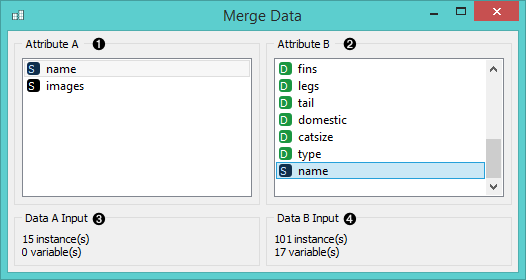

Merge Data
==========

Merges two data sets based on the values of selected attributes.

Signals
-------

**Inputs**:

- **Data A**

  Attribute-valued data set.

- **Data B**

  Attribute-valued data set.

**Outputs**:

- **Merged Data A+B**

  Instances from input data A to which attributes from input data B are added.

- **Merged Data B+A**

  Instances from input data B to which attributes from input data A are added.

Description
-----------

**Merge Data** widget is used to horizontally merge two data sets based on
the values of selected attributes. In the input, two data sets are required,
A and B. The widget allows selection of an attribute from each
domain which will be used to perform the merging. The
widget produces two outputs, A+B and B+A. A+B
corresponds to instances from input data A to which attributes
from B are appended and B+A to instances from B to which
attributes from A are appended.

Merging is done by the values of selected (merging) attributes.
First, the value of the merging attribute from A is taken and
instances from B are searched for matching values.
If more than a single instance from B is found, the first
one is taken and horizontally merged with the instance from A. If no
instance from B matches the criterium, unknown values are assigned to
the appended attributes. Similarly, B+A is constructed.

1. List of comparable attributes from Data A.
2. List of comparable attributes from Data B.
3. Information on Data A.
4. Information on Data B.

Example
-------

Merging the two data sets results in appending new attributes to the original file
based on the selected common attribute. In the example below we wanted to merge
the **zoo.tab** file containing only factual data with [**zoo-only-image.tab**](zoo-only-images.tab)
containing only images. Both files share a common string attribute *names*. Now we create
a workflow connecting the two files. The *zoo.tab* data is connected to **Data A**
input of the **Merge Data** widget, and the *zoo-only-images.tab* data to the
**Data B** input. Both outputs of the **Merge Data** widget are then
connected to the **Data Table** widget. In the latter, the
**Merged Data A+B** are shown, where image attributes are added to the original data.

Hint
----

If the two data sets consists of equally-named attributes (other than
the ones used to perform the merging), Orange will by default check for
consistency of the values of these attributes and report an error in
case of non-matching values. In order to avoid the consistency checking,
make sure that new attributes are created for each data set: you may use
'*Columns with the same name in different files represent different
variables*' option in the **File** widget for loading
the data.
