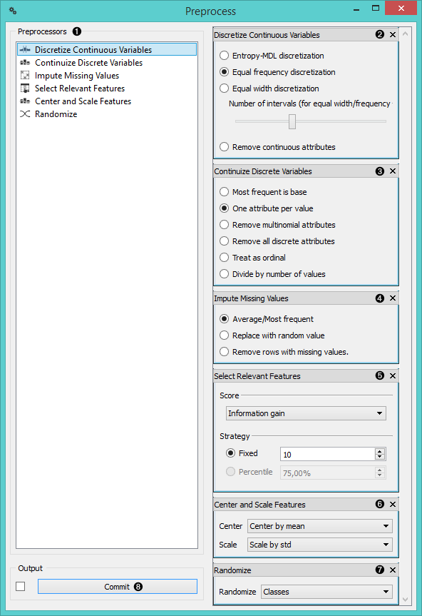

Preprocess
==========

Preprocesses the data with selected methods.

Signals
-------

**Inputs**:

- **Data**

  A data set.

**Outputs**:

- **Preprocessor**

  Preprocessing method.

- **Preprocessed Data**

  Data preprocessed with selected methods.

Description
-----------

Preprocessing is crucial for achieving better-quality analysis results. The **Preprocess** widget offers five preprocessing methods to improve data quality. In this widget you can immediately discretize continuous values or continuize discrete ones, impute missing values, select relevant features or center and scale them. Basically, this widget combines four separate widgets for simpler processing.

1. List of preprocessors
2. Discretization of continuous values
3. Continuization of discrete values
4. Impute missing values or remove them
5. Select the most relevant features by information gain, gain ratio, Gini index
6. Centering and scaling of features
7. Shuffling of features.
8. When the box is ticked (*Auto commit is on*), the widget will communicate the changes automatically.
  Alternatively, click *Commit*.

Example
-------

In the example below we have used *adult* data set and preprocessed the data. We continuized
discrete values (age, education and marital status...) as *one attribute per value*, we imputed missing values
(replacing ? with average values), selected 10 most relevant attributes by *Information gain*, 
and centered them by mean and scaled by span. We can observe the changes in a **Data Table** and compare it
to the non-processed data.

