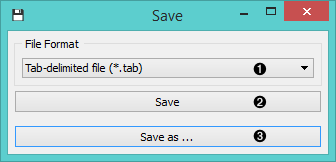

Save Data
=========

Saves data to a file.

Signals
-------

**Inputs**:

- **Data**

  A data set.

**Outputs**:

- (None)

Description
-----------

**Save Data** widget considers a data set provided in the input channel and saves
it to a data file with the specified name. It can save the data as both tab-delimited
and comma-separated files.

The widget does not save the data every time it receives a
new signal in the input as this would constantly (and, mostly,
inadvertently) overwrite the file. Instead, the data is saved only after
a new file name is set or the user pushes *Save* button.

1. Choose file format
2. Save by overwriting the existing file
3. *Save as* to create a new file

Example
-------

In the workflow below we load the data into a **Scatter Plot** widget, where
we select a subset of the data instances and push them to the **Save Data** widget to
store them in a file.

