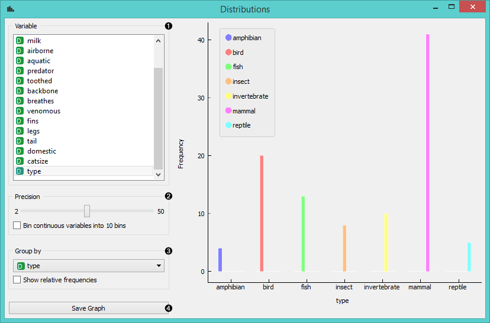
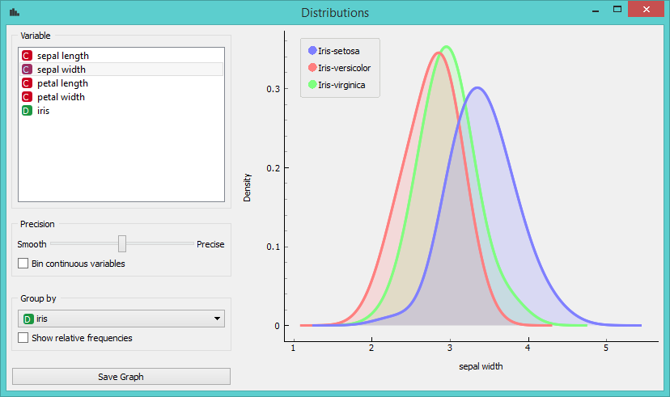
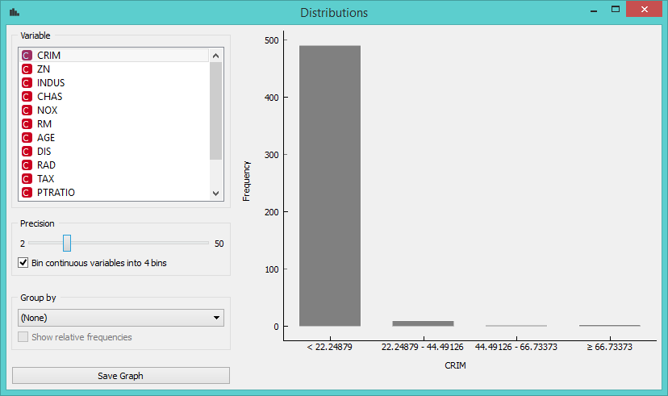

Distributions
=============

Displays value distributions for a single attribute.

Signals
-------

**Inputs**:

- **Data**

  Input data set.

**Outputs**:

- (None)

Description
-----------

**Distributions** displays [value distribution](https://en.wikipedia.org/wiki/Frequency_distribution) of 
discrete or continuous attributes. If the data contains class variable, distributions may be
conditioned on the class.

For discrete attributes, the graph displayed by the widget shows how
many times (e.g., in how many instances) each attribute
value appears in the data. If the data contains a class variable, class
distributions for each of the attribute values will be displayed as well
(like in the snapshot below).

1. A list of variables for distributions display.
2. If *Bin continuous variables* is ticked, the widget will discretize continuous
   variables by assigning them to intervals. The number of intervals is set by
   precision scale. Alternatively you can set smootheness for distribution
   curves of continuous variables.
3. The widget may be requested to display
   value distributions only for instances of certain class (*Group by*).
   *Show relative frequencies* will scale the data by percentange of the data set.
4. *Save graph* saves the graph to the computer in a .svg or .png format.

For continuous attributes, the attribute values are displayed as a function graph. Class
probabilities for continuous attributes are obtained with gaussian kernel density estimation, 
while the appearance of the curve is set with *Precision* bar (smooth or precise).

In class-less domains, the bars are displayed in gray. Here we set *Bin continuous
variables into 4 bins*, which distributes variables into 4 intervals and displays
averages of these intervals as histograms (see 2. above).

