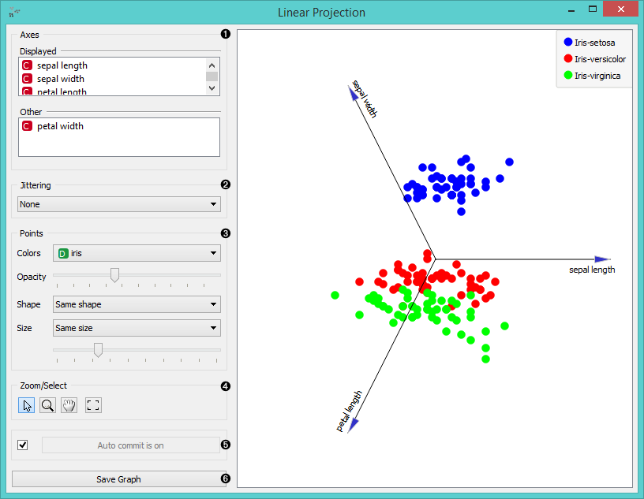

Linear Projection
=================

A linear projection method with explorative data analysis.

Signals
-------

**Inputs**:

- **Data**

  Input data set.

- **Data Subset**

  A subset of data instances.

**Outputs**:

- **Selected Data**

  A data subset that user has manually selected in the projection.

Description
-----------

This widget displays [linear projections](https://en.wikipedia.org/wiki/Projection_(linear_algebra))
of class-labeled data. Consider, for a start, a projection of an *Iris* data set shown below. Notice that it is
sepal width and sepal length that already separates *Iris setosa* from the other two,
while petal length is the attribute best separating *Iris versicolor* from *Iris virginica*.

1. Axes in the projection that are displayed and other available axes.
2. Set [jittering](https://en.wikipedia.org/wiki/Jitter) to prevent the dots from overlapping 
   (especially for discrete attributes).
3. Set color of the dots displayed (you will get colored dots for discrete values and grey-scale dots for continuous). Set opacity, shape and size to differentiate between instances.
4. *Select*, *zoom*, *pan* and *zoom to fit* options for exploring the graph. Manual selection of 
   data instances works as a non-angular/free-hand selection tool. Double click to move the projection.
    Scroll in or out for zoom.
5. When the box is ticked (*Auto commit is on*), the widget will communicate the changes automatically.
   Alternatively, click *Commit*.
6. *Save graph* saves the graph to the computer in a .svg or .png format.

Example
-------

**Linear Projection** works just like other visualization widgets. Below we connected it to the **File** widget to
see the set projected on a 2-D plane. Then we selected the data for further analysis and
connected it to the **Data Table** widget to see the details of the selected subset.

References
----------

Koren Y., Carmel L. (2003). Visualization of labeled data using linear transformations. In Proceedings of IEEE Information Visualization 2003, (InfoVis'03). Available [here](http://citeseerx.ist.psu.edu/viewdoc/download;jsessionid=3DDF0DB68D8AB9949820A19B0344C1F3?doi=10.1.1.13.8657&rep=rep1&type=pdf).

Boulesteix A.-L., Strimmer K. (2006). Partial least squares: a versatile tool for the analysis of high-dimensional genomic data. Briefings in Bioinformatics, 8(1), 32-44. Abstract [here](http://bib.oxfordjournals.org/content/8/1/32.abstract).
