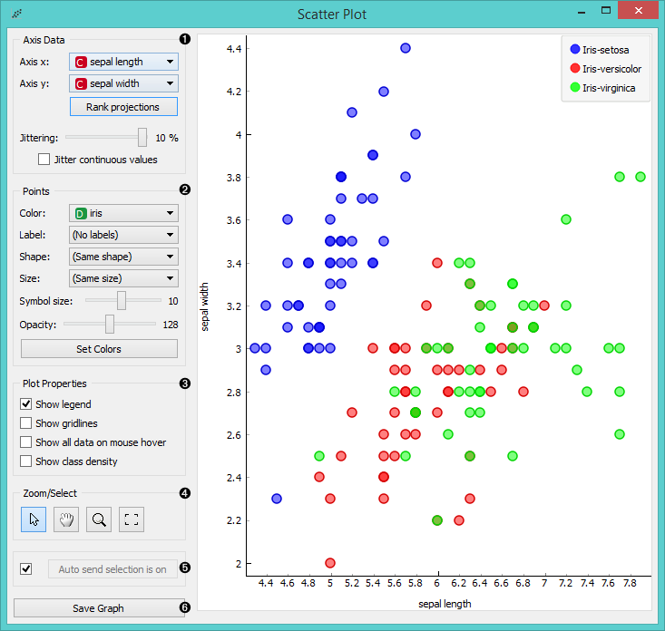
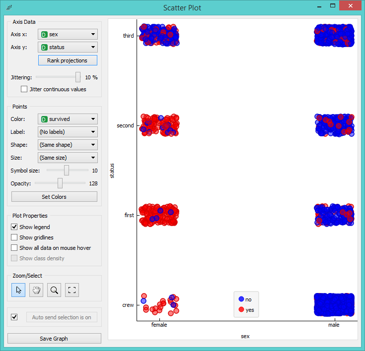
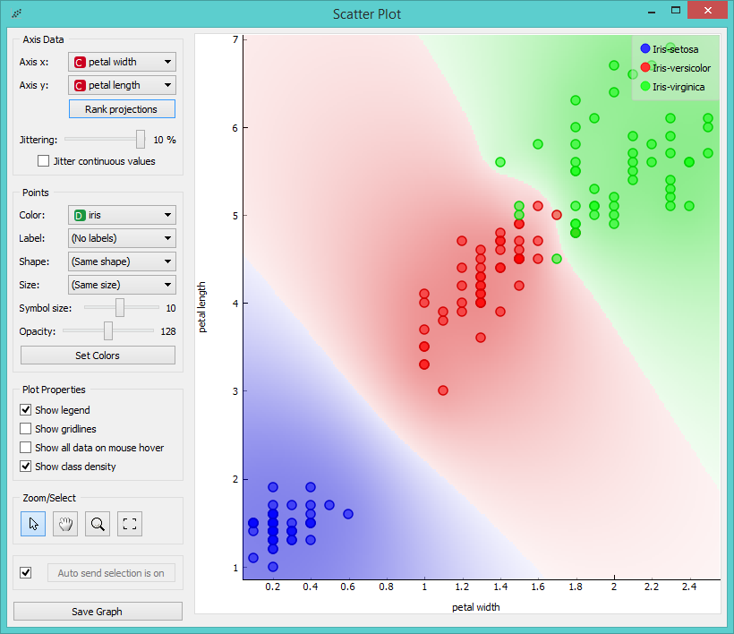

Scatter Plot
============

Scatterplot visualization with explorative analysis and
intelligent data visualization enhancements.

Signals
-------

**Inputs**:

- **Data**

  Input data set.

- **Data Subset**

  A subset of instances from the input data set.
  
- **Features**

  A list of attributes.

**Outputs**:

- **Selected Data**

  A subset of instances that the user has manually selected from the scatterplot.

- **Unselected Data**

  All other data (instances not included in the user's selection).

Description
-----------

**Scatterplot** widget provides a 2-dimensional scatterplot
visualization for both continuous and discrete-valued attributes. The
data is displayed as a collection of points, each having a value of
x-axis attribute determining the position on the horizontal axis and a
value of y-axis attribute determining the position on the vertical axis.
Various properties of the graph, like color, size and shape of the
points, axis titles, maximum point size and jittering can be adjusted on the left side of the widget. 
A snapshot below shows a scatterplot of an *Iris* data set with 
the coloring matching that of the class attribute.

1. Select x and y attribute.
    Optimize your projection using **Rank Projections**. This feature scores attribute pairs by
   average classification accuracy and returns the top scoring pair with a simultaneous
   visualization update.
    Set [*jittering*](https://en.wikipedia.org/wiki/Jitter) to prevent the dots overlapping.
   If *Jitter continuous values* is ticked, continuous instances will be dispersed.
2. Set color of the points displayed (you will get colors for discrete values and grey-scale 
   points for continuous). Set label, shape and size to differentiate between points.
   Set symbol size and opacity for all data points. Set the desired colors scale.
3. Adjust *plot properties*:
   - *Show legend* displays legend on the right. Click and drag the legend to move it.
   - *Show gridlines* displays the grid behind the plot.
   - *Show all data on mouse hover* enables information balloons if cursor is placed on a dot.
   - *Show class density* colors graph by class (see the screenshot below).
4. Select, zoom, pan and zoom to fit options for exploring the graph. Manual selection of data instances 
   works as an angular/square selection tool. Double click to move the projection. Scroll in or out for zoom.
5. If *Auto commit is on*, changes are communicated automatically. Alternatively press *Commit*.
6. *Save graph* saves the graph to the computer in a .svg or .png format.

For discrete attributes, jittering circumvents the overlap of the points with the same value for both axes, 
and therefore the density of the points in the region corresponds better to the data. As an example, a 
scatterplot for the Titanic data set reporting on the gender of the passengers and the traveling class 
is shown below; without jittering, scatterplot would display only eight distinct points.

Here is an example of **Scatter Plot** widget if the *Show class density* box is ticked.

Intelligent Data Visualization
------------------------------

If a data set has many attributes, it is impossible to manually scan through all the pairs
to find interesting or useful scatterplots. Orange implements intelligent data visualization
with **Rank Projections** option in the widget. The goal of optimization is to find scatterplot
projections, where instances are well separated.

To use this method go to *Rank Projections* option in the widget, open the subwindow and
press *Start Evaluation*. The feature will return a list of attribute pairs by average
classification accuracy score.

Below there is an example demonstrating the utility of ranking. The first scatterplot
projection was set as a default sepal width to sepal length plot (we used Iris data set for simplicity).
Upon running *Rank Projections* optimization, the scatterplot converted to a much better projection
of petal width to petal length plot.

Explorative Data Analysis
-------------------------

**Scatterplot**, as the rest of Orange widgets, supports zooming-in and out
of the part of the plot and a manual selection of data instances. These functions
are available in the lower left corner of the widget. The default tool is *Select*, which
selects data instances within the chosen rectangular area. *Pan* enables you to
move the scatterplot around the pane. With *Zoom* you can zoom in and out of the pane with a
mouse scroll, while *Reset zoom* resets the visualization to its optimal size. An example of a simple 
schema where we selected data instances from a rectangular region and sent them to the **Data Table**
widget is shown below. Notice that the scatterplot doesn't show all 52 data instances, 
because some data instances overlap (they have the same values for both attributes used).

Example
-------

Scatterplot can be combined with any widget that outputs a list
of selected data instances. In the example below we combine **Classification Tree** 
and **Scatterplot** to display instances taken from a chosen classification tree node
(clicking on any node of classification tree would send a set of
selected data instances to the scatterplot and mark selected instances with filled symbols).

